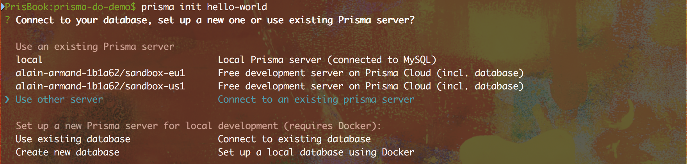
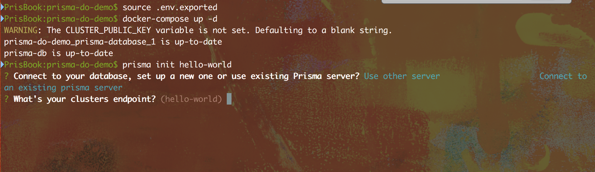

### Setup

## export token named do-prisma on digitlocean

Run `export DO_PRISMA_TOKEN=Example059af5f560570dc21b9a3043dfbc13a41c8349d98dff9`

Make sure its there: `echo ${DO_PRISMA_TOKEN}`

Get regions list:

```curl
    curl -X GET "https://api.digitalocean.com/v2/regions" \
        -H "Authorization: Bearer $DO_PRISMA_TOKEN"
```

Run: `docker-machine create --driver digitalocean --digitalocean-access-token 7Example136059af5f560570dc21b9a3043dfbc13a41c8349d98dff9 --digitalocean-size 1gb --digitalocean-region ams3 prisma`

Find the running docker-machine container: `docker-machine ls` and its ip address.
Get the env vars: `docker-machine env prisma`.
Access that container environment, run: `eval $(docker-machine env prisma)`.
Verify you are in that container environment, run: `docker-machine active`. Now you have accessed the remote environment for prisma which is on DigitalOcean and all command you run while in that env will run against the remote machine.

Run `dockerize-env` on .env.

Add `env.vars` to `docker-compose.yml`:

```yml
services:
  prisma-db:
    env_file: .env.vars
    image: mysql:5.7
    container_name: prisma-db
    networks:
      - prisma
```

Run `source .env.exported`.
Run `docker-compose up -d`.
Enter remote docker container run verification, comes back empty string because I have not set it?

```bsh
Last login: Fri Apr 27 15:12:28 2018 from 82.255.68.105
root@prisma:~# docker exec prisma-database bash -c 'echo "$CLUSTER_PUBLIC_KEY"'
Error: No such container: prisma-database
root@prisma:~# docker exec prisma-db bash -c 'echo "$CLUSTER_PUBLIC_KEY"'

root@prisma:~# docker exec prisma bash -c 'echo "$CLUSTER_PUBLIC_KEY"'
Error: No such container: prisma
root@prisma:~#
logout
```

Create cluster entry and then add it to `~/.prisma.config.yml`

```bash
PrisBook:prisma-do-demo$ sed -e "s/\__DROPLET_IP_ADDRESS__/$(docker-machine ip prisma)/" cluster-template.yml
clusters:
    digital-ocean-cluster:
          host: 'http://206.189.7.98:4466'
```

In `~/.prisma.config.yml`:

```yml
clusters:
  digital-ocean-cluster:
    host: 'http://206.189.7.98:4466'
        clusterSecret: mysecret123
  local:
    host: 'http://localhost:4466'
```

## Running `prisma init hello-world`



What is the endpoint we are to enter here?


If I leave it blank or add `http://206.189.7.98:4466` on digital ocean, i get port is already allocated.
